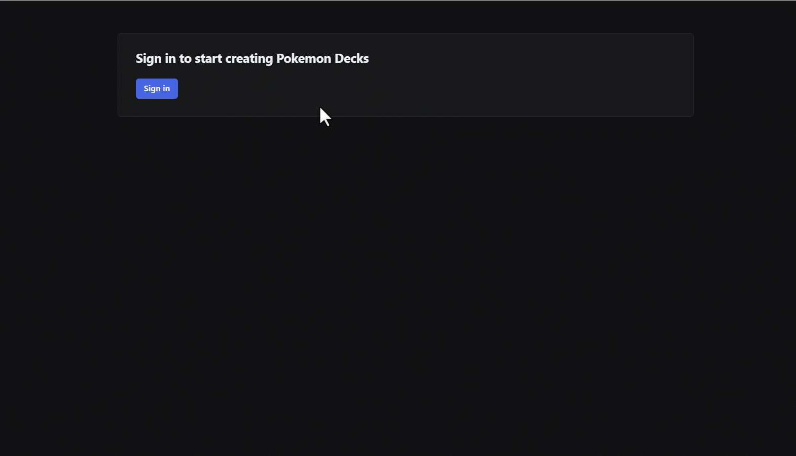

## Radix Themes  with  NextJS & WorkOS


### Used Technologies

- [Next.js](https://nextjs.org/) - The React Framework for the Web
- [Radix Themes](https://www.radix-ui.com/) - An open source component library optimized for fast development, easy maintenance, and accessibility.
- [WorkOS](https://workos.com/) - WorkOS is a suite of building blocks for quickly adding enterprise features to your app, such as single sign-on (SSO). It provides a unified interface for integrating with a multitude of enterprise identity providers and directory services. WorkOS offers developer-friendly features such as SDKs and a modern API.
- [AuthKit](https://www.authkit.com/) - The world’s best login box, powered by WorkOS + Radix.

### How does this work




## Getting Started

First, run the development server:

```bash
npm run dev
# or
yarn dev
# or
pnpm dev
# or
bun dev


.env.development.local

WORKOS_REDIRECT_URI=http://localhost:3000/callback
WORKOS_COOKIE_PASSWORD=
WORKOS_CLIENT_ID=
WORKOS_API_KEY=
```

Open [http://localhost:3000](http://localhost:3000) with your browser to see the result.


---

##### Contact with me:

[][linkedin]

[linkedin]: https://www.linkedin.com/in/sergiy-antonyuk/

##### I can't express how much I have learned from [you](https://www.youtube.com/@jherr) ! <br> Thanks for the hard and smart work.
